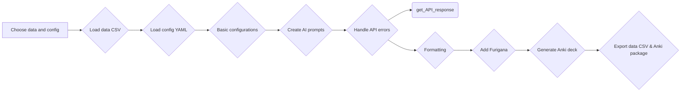
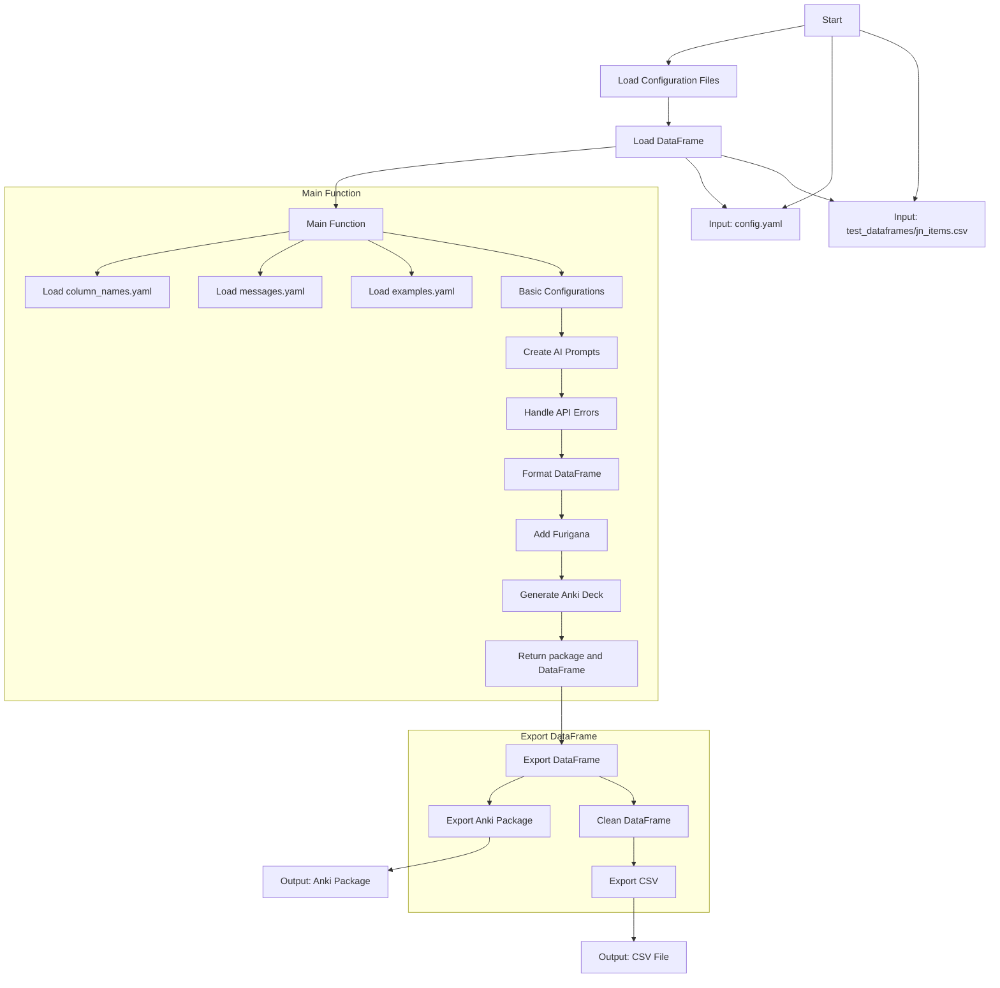

# Automatic Flashcard creation (Anki) with chatGPT

```python
if value in items:
	print(value)
```

A web interface, that allows you to transform the export.csv from LanguageReactor into beautiful, custom flashcards for the SRS Program ANKI.
Just choose your dataframe, which fields you would like to generate and it will return an .apkg as well as a .csv file.





